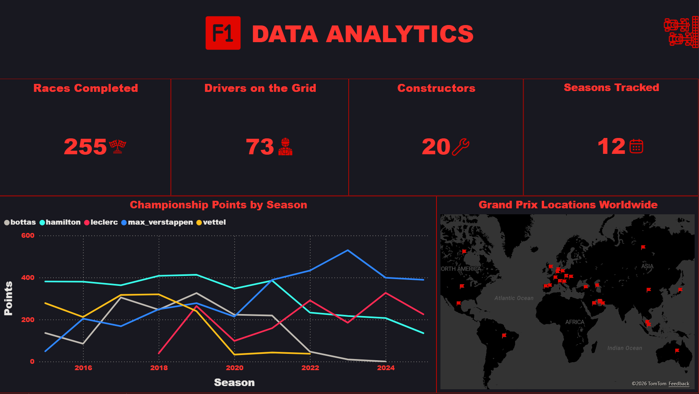
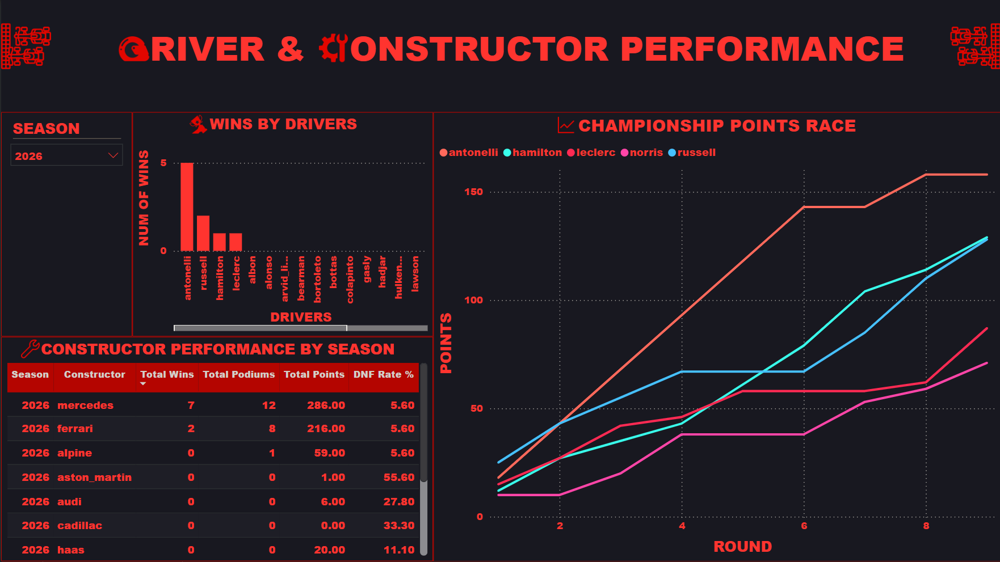
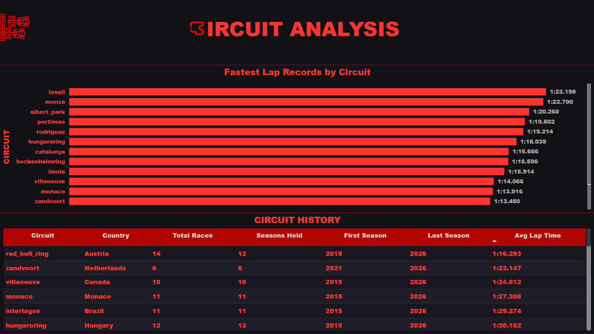

# 🏎️ F1 Data Engineering Platform

> **End-to-end Data Engineering project built around Formula 1 racing data.**
> From a simple Python ETL script to a fully containerized streaming and analytics platform — built incrementally, one step at a time.

---

## 👤 Author
**Amr Hagag** — Data Engineering Student & DEPI Trainee
- 📧 amr.hagag.prof@gmail.com
- 💼 [linkedin.com/in/amrhagag-dataeng](https://linkedin.com/in/amrhagag-dataeng)
- 🐙 [github.com/3mrZain7agag](https://github.com/3mrZain7agag)

---

## 🎯 Project Goal

A portfolio-grade, end-to-end Data Engineering platform that demonstrates mastery of the full modern DE stack:
- Data ingestion from REST APIs
- Data Warehouse design (Star Schema)
- Workflow orchestration (Apache Airflow)
- Data Lake architecture (Bronze / Silver / Gold)
- Distributed processing (Apache Spark)
- Streaming architecture (Apache Kafka)
- Data quality (Great Expectations)
- Transformations (dbt)
- Machine Learning (scikit-learn + MLflow)
- Dashboarding (Power BI)

---

## 🗺️ Progressive Build Roadmap

| Step | Title | Status | Key Tools |
|------|-------|--------|-----------|
| 01 | Simple Python ETL | ✅ Complete | Python, Pandas, SQLite |
| 02 | Local Data Warehouse | ✅ Complete | PostgreSQL, Star Schema, Docker |
| 03 | Airflow Orchestration | ✅ Complete | Apache Airflow, DAGs, psycopg2 |
| 04 | Bronze Data Lake | ✅ Complete | MinIO, boto3, S3-compatible storage |
| 05 | PySpark Silver Layer | ✅ Complete | Apache Spark 3.5, Iceberg, Java 17 |
| 06 | dbt Gold Layer | ✅ Complete | dbt-core, dbt-spark, Parquet |
| 07 | Data Quality | ✅ Complete | Great Expectations |
| 08 | Kafka Streaming | ✅ Complete | Apache Kafka, Spark Structured Streaming |
| 09 | Power BI Dashboard | ✅ Complete | Power BI |
| 10 | Machine Learning | 🔲 Upcoming | scikit-learn, MLflow, XGBoost |

---

## 🚀 Quick Start

> **Everything runs on GitHub Codespaces — no local installation needed.**

### First Time Only
```bash
bash scripts/setup.sh
```

### Every Time You Reopen Codespace
```bash
bash scripts/start.sh
```

### Check What's Running
```bash
bash scripts/status.sh
```

### Full Steps Reference
```bash
bash scripts/steps.sh
```

### Run the Full Pipeline
```bash
bash scripts/step03.sh   # Airflow: pull data + load warehouse
bash scripts/step04.sh   # Upload raw CSVs to Bronze (MinIO)
bash scripts/step05.sh   # Transform Bronze → Silver (PySpark + Iceberg)
bash scripts/step07.sh   # Validate Silver data quality (Great Expectations)
bash scripts/step06.sh   # Transform Silver → Gold (dbt)
bash scripts/step08.sh   # Kafka race replay + Spark Streaming consumer
bash scripts/step09.sh   # Export Gold layer to CSV for Power BI
```

### Save Your Work to GitHub
```bash
bash scripts/git_save.sh "your message here"
```

---

## 📋 Scripts Reference

### 🔧 Setup & Lifecycle

| Script | Usage | Purpose |
|--------|-------|---------|
| `setup.sh` | `bash scripts/setup.sh` | Run **once** — installs everything (Java 17, Airflow, dbt, GE, Kafka client, creates buckets) |
| `start.sh` | `bash scripts/start.sh` | Start **all** services + git pull |
| `stop.sh` | `bash scripts/stop.sh` | Stop **all** services + streaming consumer |
| `status.sh` | `bash scripts/status.sh` | Check status of all services + data summary |
| `steps.sh` | `bash scripts/steps.sh` | Full reference dictionary — what each step does, prerequisites, how to run |
| `view_gold.sh` | `bash scripts/view_gold.sh [season]` | Quick query of Gold layer analytics tables (defaults to 2024) |
| `git_save.sh` | `bash scripts/git_save.sh "message"` | Commit and push to GitHub |

### 🐳 Individual Service Control

| Script | Usage | Purpose |
|--------|-------|---------|
| `start_postgres.sh` | `bash scripts/start_postgres.sh` | Start PostgreSQL only |
| `start_minio.sh` | `bash scripts/start_minio.sh` | Start MinIO only |
| `start_airflow.sh` | `bash scripts/start_airflow.sh` | Start Airflow webserver + scheduler |
| `start_spark.sh` | `bash scripts/start_spark.sh` | Start Spark master + worker |
| `start_kafka.sh` | `bash scripts/start_kafka.sh` | Start Kafka + Zookeeper + Kafka UI |
| `stop_postgres.sh` | `bash scripts/stop_postgres.sh` | Stop PostgreSQL only |
| `stop_minio.sh` | `bash scripts/stop_minio.sh` | Stop MinIO only |
| `stop_airflow.sh` | `bash scripts/stop_airflow.sh` | Stop Airflow only |
| `stop_spark.sh` | `bash scripts/stop_spark.sh` | Stop Spark only |
| `stop_kafka.sh` | `bash scripts/stop_kafka.sh` | Stop Kafka + streaming consumer |

### 📊 Pipeline Steps

| Script | Usage | Purpose |
|--------|-------|---------|
| `step01.sh` | `bash scripts/step01.sh` | Pull all F1 seasons from API (one by one) |
| `step01.sh` | `bash scripts/step01.sh 2024` | Pull a single season |
| `step02.sh` | `bash scripts/step02.sh` | Load CSVs into PostgreSQL DWH |
| `step03.sh` | `bash scripts/step03.sh` | Trigger + unpause Airflow DAGs |
| `step04.sh` | `bash scripts/step04.sh` | Upload raw CSVs to Bronze (MinIO) |
| `step05.sh` | `bash scripts/step05.sh` | Transform Bronze → Silver (PySpark) |
| `step06.sh` | `bash scripts/step06.sh` | Transform Silver → Gold (dbt) |
| `step07.sh` | `bash scripts/step07.sh` | Validate Silver data quality (Great Expectations) |
| `step08.sh` | `bash scripts/step08.sh [season] [round]` | Kafka race replay + Spark Streaming consumer |
| `step09.sh` | `bash scripts/step09.sh` | Export Gold layer tables to CSV (`exports/gold/`) for Power BI |

### 📅 Daily Workflow
```
Morning:
  bash scripts/start.sh          ← starts everything + pulls latest code
  bash scripts/status.sh         ← verify everything is running

Work on the project...

Save progress:
  bash scripts/git_save.sh "feat: what I did today"

End of day:
  bash scripts/stop.sh           ← stop everything cleanly
```

### 🔧 Troubleshooting
```bash
# Java version reset? Re-export Java 17
export JAVA_HOME=/usr/lib/jvm/java-17-openjdk-amd64
export PATH=$JAVA_HOME/bin:$PATH

# Spark not starting?
bash scripts/stop_spark.sh
bash scripts/start_spark.sh

# Silver bucket missing after restart?
bash scripts/step05.sh  # recreates bucket automatically

# dbt LOCATION_ALREADY_EXISTS error?
rm -rf dbt/f1_gold/spark-warehouse dbt/f1_gold/target
bash scripts/step06.sh  # cleans automatically now

# Rate limit on API? Run seasons one by one
bash scripts/step01.sh 2024
sleep 120
bash scripts/step01.sh 2025

# Force re-upload Bronze data
python3 -c "from datalake.bronze.ingest_to_bronze import ingest_to_bronze; ingest_to_bronze(force=True)"

# Kafka producer/consumer issues? Check logs
tail -f /tmp/f1_consumer.log
```

---

## ✅ Step 01 — Simple Python ETL

### What it does
Pulls F1 historical data (2015–2025) from the [Jolpica API](https://api.jolpi.ca) and saves locally as CSV + SQLite.

### Data extracted
| Entity | Rows |
|--------|------|
| Races | 233 |
| Drivers | 71 |
| Constructors | 18 |
| Circuits | 32 |
| Race Results | 4,698 |
| Qualifying | 4,684 |
| Pit Stops | 8,364 |
| Lap Times | 32,747 |

### Run it
```bash
bash scripts/step01.sh             # all seasons (2min sleep between each)
bash scripts/step01.sh 2024        # single season
```

### Key features
- ✅ Retry logic + 429 rate limit handling (60s wait)
- ✅ One season at a time with 2min sleep
- ✅ Incremental loading (skips already downloaded data)
- ✅ Structured JSON logging

### Known limitation
Jolpica API returns incomplete lap time data for some seasons.

---

## ✅ Step 02 — Local Data Warehouse (Star Schema)

### What it does
Loads raw CSVs into PostgreSQL modeled as a **Star Schema**.

### Star Schema
```
                    dim_drivers
                         │
dim_circuits ── fact_race_results ── dim_constructors
                         │
                    dim_races
                         │
                    dim_dates
```

### Run it
```bash
bash scripts/step02.sh
```

### Example queries
```sql
SELECT d.full_name, SUM(f.points) AS total_points
FROM fact_race_results f
JOIN dim_drivers d ON f.driver_key = d.driver_key
GROUP BY d.full_name
ORDER BY total_points DESC
LIMIT 10;
```

---

## ✅ Step 03 — Apache Airflow Orchestration

### DAGs
```
dag_ingest_f1          → Step 01: pulls data, one season at a time (Mon 02:00 UTC)
dag_ingest_to_bronze   → Step 04: uploads to MinIO Bronze, force refresh (Mon 03:00 UTC)
dag_bronze_to_silver   → Step 05: PySpark Silver layer (Mon 04:00 UTC)
dag_data_quality       → Step 07: Great Expectations checks (Mon 04:30 UTC)
dag_silver_to_gold     → Step 06: dbt Gold layer (Mon 05:00 UTC)
dag_kafka_replay       → Step 08: streaming replay (manual trigger only)
```

### Run it
```bash
bash scripts/start.sh
bash scripts/step03.sh     # triggers + unpauses all DAGs
# Open port 8080 → admin / admin123
```

### Key features
- ✅ Six DAGs covering ingestion through streaming
- ✅ Auto-unpause DAGs on trigger
- ✅ Automatic retries on failure
- ✅ REST API enabled for VS Code Airflow extension

---

## ✅ Step 04 — Bronze Data Lake (MinIO)

### Bronze Layer Structure
```
s3://f1-bronze/
├── ergast/
│   ├── races/races.csv
│   ├── drivers/drivers.csv
│   ├── constructors/constructors.csv
│   ├── circuits/circuits.csv
│   ├── results/results.csv
│   ├── qualifying/qualifying.csv
│   ├── pit_stops/pit_stops.csv
│   └── lap_times/lap_times.csv
└── kafka/
    └── lap_events/          ← streamed data from Step 08
```

### Run it
```bash
bash scripts/step04.sh          # incremental — skips existing files
```

### Key features
- ✅ MinIO running in Docker — identical API to AWS S3
- ✅ `storage_client.py` — switches between MinIO and AWS S3 via single env var
- ✅ Incremental uploads with force re-upload flag

---

## ✅ Step 05 — PySpark Silver Layer (Apache Iceberg)

### What it does
Reads raw CSV files from Bronze, applies cleaning and type enforcement, and writes clean **Parquet files** as **Apache Iceberg tables** to the Silver layer.

### Silver Tables
| Table | Rows | Key Additions |
|-------|------|--------------|
| silver.races | 233 | race_date (DateType) |
| silver.race_results | 4,698 | is_classified flag |
| silver.drivers | 71 | date_of_birth (DateType) |
| silver.circuits | 32 | lat/long (DoubleType) |
| silver.qualifying | 4,684 | q1_ms, q2_ms, q3_ms |
| silver.pit_stops | 8,364 | duration_ms |
| silver.lap_times | 32,747 | lap_time_ms |

### Run it
```bash
bash scripts/step05.sh   # runs all 7 transformations + creates f1-silver bucket
```

### Key features
- ✅ Apache Spark 3.5.0 running in Docker
- ✅ Java 17 (required — Java 25 is incompatible with Spark)
- ✅ Apache Iceberg 1.5 with ACID transactions
- ✅ `spark_session.py` — reusable factory, switches MinIO ↔ AWS S3 via env var

### Lessons learned
- Java 25 is incompatible with Spark 3.5 — must use Java 17
- `JAVA_HOME` resets on Codespace restart — added to `start.sh` and `~/.bashrc`
- CSV schema must match column order exactly when using explicit StructType

---

## ✅ Step 06 — dbt Gold Layer

### What it does
Reads Silver layer data and applies business logic — joins, aggregations, Star Schema modeling — using **dbt**. Produces analytics-ready Gold tables with built-in data quality tests.

### dbt Project Structure
```
dbt/f1_gold/
├── models/
│   ├── staging/              ← 1:1 views on Silver tables (7 models)
│   └── marts/
│       ├── core/              ← Star Schema fact + dim tables (6 models)
│       └── analytics/         ← Pre-aggregated reporting tables (3 models)
├── seeds/                     ← static reference data
├── snapshots/                 ← (reserved, not yet used)
├── analyses/                  ← (reserved, not yet used)
└── tests/                     ← custom test definitions
```

### Gold Tables
| Model | Type | Description |
|-------|------|--------------|
| dim_drivers | Dimension | Driver profiles |
| dim_circuits | Dimension | Circuit metadata |
| dim_races | Dimension | Race calendar |
| fact_race_results | Fact | Results + qualifying joined |
| fact_lap_times | Fact | Clean lap times |
| fact_pit_stops | Fact | Clean pit stop events |
| agg_driver_season_stats | Analytics | Wins, podiums, points per driver per season |
| agg_constructor_season_stats | Analytics | Team performance, DNF rate per season |
| agg_circuit_stats | Analytics | Circuit history and lap records |

### Run it
```bash
bash scripts/step06.sh   # runs dbt models + tests
```

### View analytics output
```bash
bash scripts/view_gold.sh 2024
```

### Verified accuracy
- ✅ 2024 Drivers Champion: Verstappen (399 pts, 9 wins)
- ✅ 2024 Constructors Champion: McLaren (609 pts, 6 wins)
- ✅ Bahrain GP 2024 podium: Verstappen, Perez, Sainz

### Data Quality Tests
18 dbt tests — `not_null`, `unique` — all passing.

### Known limitation
**Gold tables are stored locally** (`dbt/f1_gold/spark-warehouse/`), not in MinIO. This is a known `dbt-spark` session-mode limitation with custom Iceberg catalogs.

### Lessons learned
- `LOCATION_ALREADY_EXISTS` errors require cleaning `spark-warehouse/` before every `--full-refresh` run
- Default Hive table format isn't Parquet — must set `+file_format: parquet` explicitly
- **Never commit `metastore_db/`, `spark-warehouse/`, `logs/`, `target/`, or `__pycache__/` to git** (197 files removed after initial mistake) — worth periodically re-checking `.gitignore` coverage, since these directories can silently reappear after a `dbt` run

---

## ✅ Step 07 — Data Quality (Great Expectations)

### What it does
Validates the Silver layer against automated data quality rules **before** dbt builds the Gold layer.

### Where It Sits
```
Bronze → PySpark → Silver → [Great Expectations Checkpoint] → dbt → Gold
                                        │
                                   FAIL → halt, alert
                                   PASS → continue
```

### Checkpoints Built
| Table | Checks |
|-------|--------|
| silver.race_results | season not null, driver_id not null, position [1-24], points [0-26], no duplicates, status not null |
| silver.lap_times | driver_id not null, lap_number [1-100], lap_time_ms realistic range, no duplicate season+round+driver+lap |

### Run it
```bash
bash scripts/step07.sh
```

### Key features
- ✅ Great Expectations 0.18.19, ephemeral context mode
- ✅ 10 automated checks across 2 Silver tables
- ✅ `dag_data_quality` Airflow DAG — runs between Silver and Gold DAGs

---

## ✅ Step 08 — Kafka Streaming Layer

### What it does
Simulates a live F1 race by replaying historical lap data through **Apache Kafka**, consumed in near real-time by a **Spark Structured Streaming** job that writes micro-batches into Bronze.

### Architecture
```
Silver (lap_times, Iceberg)
       │
       ▼  race_replay_producer.py
Kafka Topic: f1.lap_events
       │
       ▼  spark_streaming_consumer.py (10s micro-batches)
Bronze: s3://f1-bronze/kafka/lap_events/ (Parquet, streamed)
```

### What We Built
| Component | File | Purpose |
|-----------|------|---------|
| Topic config | `streaming/producer/topic_config.py` | Central Kafka topic definitions |
| Producer | `streaming/producer/race_replay_producer.py` | Reads Silver lap data, publishes to Kafka in lap order |
| Consumer | `streaming/consumer/spark_streaming_consumer.py` | Spark Structured Streaming job reading Kafka → Bronze |

### Kafka Stack (Docker)
| Service | Port | Purpose |
|---------|------|---------|
| Zookeeper | 2181 | Kafka coordination |
| Kafka | 9092 | Message broker |
| Kafka UI | 8085 | Browse topics and messages |

### Run it
```bash
bash scripts/step08.sh              # replays 2024 round 1 by default
bash scripts/step08.sh 2023 5       # replay season 2023, round 5
```

### Verified end-to-end
- 200 lap events published to Kafka in under 1 second
- All 200 events consumed and written to Bronze as Parquet within ~13 seconds
- Data integrity confirmed: Verstappen's Bahrain 2024 Lap 1 time (97.284s) intact through the full pipeline

### Key features
- ✅ Kafka + Zookeeper + Kafka UI running in Docker
- ✅ Configurable replay speed (`--speed` flag; 50x default, 0 = instant)
- ✅ Spark Structured Streaming with 10-second micro-batch trigger
- ✅ `dag_kafka_replay` Airflow DAG — season/round configurable via Airflow Variables
- ✅ Detached consumer process — survives after producer finishes

### Lessons learned
- `kafka-python` has a compatibility bug on newer Python versions (`kafka.vendor.six.moves` missing) — fixed by switching to the maintained fork `kafka-python-ng`
- Spark Structured Streaming requires its own Kafka connector JAR (`spark-sql-kafka-0-10`), separate from the `kafka-python` producer library
- `startingOffsets: earliest` lets the consumer pick up messages sent before it started
- Long-running streaming consumers don't fit Airflow's task model well — best run as a detached background process

---

## ✅ Step 09 — Power BI Dashboard

### What it does
Exports the Gold layer analytics tables and builds an interactive 3-page Power BI dashboard with a custom dark F1 theme, cross-filtering, and cross-page navigation.

### Dashboard Pages
| Page | Contents |
|------|----------|
| Overview | KPI cards (races, drivers, constructors, seasons), championship points trend, worldwide Grand Prix map with hover tooltips |
| Driver & Constructor Performance | Top 10 wins by driver, season slicer, cumulative championship points race, constructor performance table |
| Circuit Analysis | Fastest lap records by circuit, circuit history table (total races, seasons held, avg lap time) |

### Export pipeline
```bash
bash scripts/step09.sh                 # wraps: python export/export_gold_to_csv.py
```

> Exports shell out to `dbt show` rather than opening an independent Spark session, since `dbt-spark`'s session-mode Derby metastore is only safely accessible from dbt's own process. Output CSVs land in `exports/gold/`, one file per Gold table, which is what Power BI connects to.

### Key features
- ✅ All 9 Gold tables loaded into a Power BI star schema model
- ✅ Custom dark F1 theme (page-level background styling to avoid Filters pane rendering issues)
- ✅ Top N filtering on driver wins chart, right-aligned numeric tables
- ✅ Cross-page navigation via custom icon buttons
- ✅ Map tooltips showing circuit, country, and race count on hover

### Preview






🎥 [Watch the full demo video](docs/PowerBI/F1_Power_demo.mp4)

https://github.com/user-attachments/assets/2317fd81-3cf5-448c-85fd-0659d45d635d

### Lessons learned
- `dbt show --output json` is a reliable way to pull Gold layer data into Power BI without fighting Spark session conflicts
- Power BI theme JSON: report-level `background`/`foreground` keys break the Filters pane — background styling must live inside `visualStyles` at the page level
- Top N filters must reference the same field as the visual's value (not a different metric), or the filter silently doesn't reduce visual clutter as expected

### Icon credits
Dashboard icons sourced from [Flaticon](https://www.flaticon.com/). One icon set requires attribution per its license terms.

---

## 🗂️ Project Structure

```
f1-data-engineering/
├── ingestion/
│   ├── ergast_client.py          ← API client (retry, pagination, 429)
│   └── extract_all.py            ← ETL runner (8 extractors)
├── warehouse/
│   ├── schema.sql                ← Star Schema DDL
│   └── load_warehouse.py         ← CSV → PostgreSQL (psycopg2)
├── datalake/
│   ├── storage_client.py         ← S3/MinIO unified client
│   └── bronze/
│       └── ingest_to_bronze.py   ← Upload to Bronze layer
├── processing/
│   └── silver/
│       ├── spark_session.py      ← Spark + Iceberg factory
│       ├── bronze_to_silver_races.py
│       ├── bronze_to_silver_results.py
│       ├── bronze_to_silver_drivers.py
│       ├── bronze_to_silver_circuits.py
│       ├── bronze_to_silver_qualifying.py
│       ├── bronze_to_silver_pitstops.py
│       ├── bronze_to_silver_laps.py
│       └── run_all_silver.py     ← Master runner
├── dbt/
│   └── f1_gold/                  ← dbt project (staging + marts, seeds, snapshots, tests)
├── quality/
│   └── checkpoints/
│       ├── validate_race_results.py
│       ├── validate_lap_times.py
│       └── run_all_checks.py     ← Master quality runner
├── streaming/
│   ├── producer/
│   │   ├── topic_config.py
│   │   └── race_replay_producer.py
│   └── consumer/
│       └── spark_streaming_consumer.py
├── export/
│   └── export_gold_to_csv.py     ← Gold layer → CSV, for Power BI
├── exports/
│   └── gold/                     ← CSV output from export_gold_to_csv.py (9 Gold tables)
├── infra/
│   ├── environments/dev/main.tf  ← Terraform env config (AWS infra currently torn down)
│   └── modules/
│       ├── iam/main.tf
│       └── s3/main.tf
├── docs/
│   └── PowerBI/                  ← Dashboard screenshots + demo video
├── orchestration/dags/
│   ├── dag_ingest_f1.py
│   ├── dag_load_warehouse.py
│   ├── dag_ingest_to_bronze.py
│   ├── dag_bronze_to_silver.py
│   ├── dag_data_quality.py
│   ├── dag_silver_to_gold.py
│   └── dag_kafka_replay.py
├── scripts/
│   ├── setup.sh                  ← First-time setup
│   ├── start.sh                  ← Start all services
│   ├── stop.sh                   ← Stop all services
│   ├── status.sh                 ← Service + data status dashboard
│   ├── start_postgres.sh
│   ├── start_minio.sh
│   ├── start_airflow.sh
│   ├── start_spark.sh
│   ├── start_kafka.sh
│   ├── stop_postgres.sh
│   ├── stop_minio.sh
│   ├── stop_airflow.sh
│   ├── stop_spark.sh
│   ├── stop_kafka.sh
│   ├── step01.sh
│   ├── step02.sh
│   ├── step03.sh
│   ├── step04.sh
│   ├── step05.sh
│   ├── step06.sh
│   ├── step07.sh
│   ├── step08.sh
│   ├── step09.sh
│   ├── steps.sh                  ← Steps reference dictionary
│   ├── view_gold.sh
│   └── git_save.sh
├── utils/
│   └── logger.py
├── docker/
│   └── docker-compose.yml        ← PostgreSQL + MinIO + Spark + Kafka
├── data/raw/                     ← gitignored
├── airflow/                      ← gitignored
├── requirements.txt
└── README.md
```

---

## 🛠️ Tech Stack (Current)

| Tool | Version | Purpose |
|------|---------|---------|
| Python | 3.12 | Pipeline code |
| Pandas | 2.2.2 | Data manipulation |
| Requests + Tenacity | Latest | API calls with retry |
| psycopg2 | 2.9.9 | PostgreSQL connector |
| boto3 | 1.34.144 | S3/MinIO client |
| PySpark | 3.5.0 | Distributed data processing |
| Apache Iceberg | 1.5.0 | ACID table format on S3/MinIO |
| Java | 17 | Required for Spark |
| dbt-core | 1.11.11 | SQL transformation framework |
| dbt-spark | 1.10.3 | dbt Spark adapter |
| great_expectations | 0.18.19 | Data quality validation |
| Apache Kafka | 7.6.0 (Confluent) | Streaming message broker |
| kafka-python-ng | 2.2.2 | Python Kafka producer client |
| PostgreSQL | 15 | Data Warehouse |
| MinIO | Latest | Local S3-compatible storage |
| Apache Airflow | 2.9.3 | Pipeline orchestration |
| Docker Compose | 2.40 | Local service management |
| Terraform | Latest | AWS infra as code (currently torn down; modules retained for reference) |
| Power BI Desktop | Latest | Dashboarding and analytics |

---

## 🖥️ Service Ports

| Service | Port | Credentials |
|---------|------|-------------|
| PostgreSQL | 5432 | f1user / f1password |
| MinIO API | 9000 | f1minio / f1minio123 |
| MinIO UI | 9001 | f1minio / f1minio123 |
| Airflow UI | 8080 | admin / admin123 |
| Spark Master UI | 8082 | — |
| Spark Connect | 7077 | — |
| Kafka | 9092 | — |
| Kafka UI | 8085 | — |

---

## 📝 Commit Convention

| Prefix | Usage |
|--------|-------|
| `feat:` | New feature or step |
| `fix:` | Bug fix |
| `docs:` | Documentation update |
| `refactor:` | Code improvement |
| `test:` | Adding tests |
| `chore:` | Setup, scripts, config |